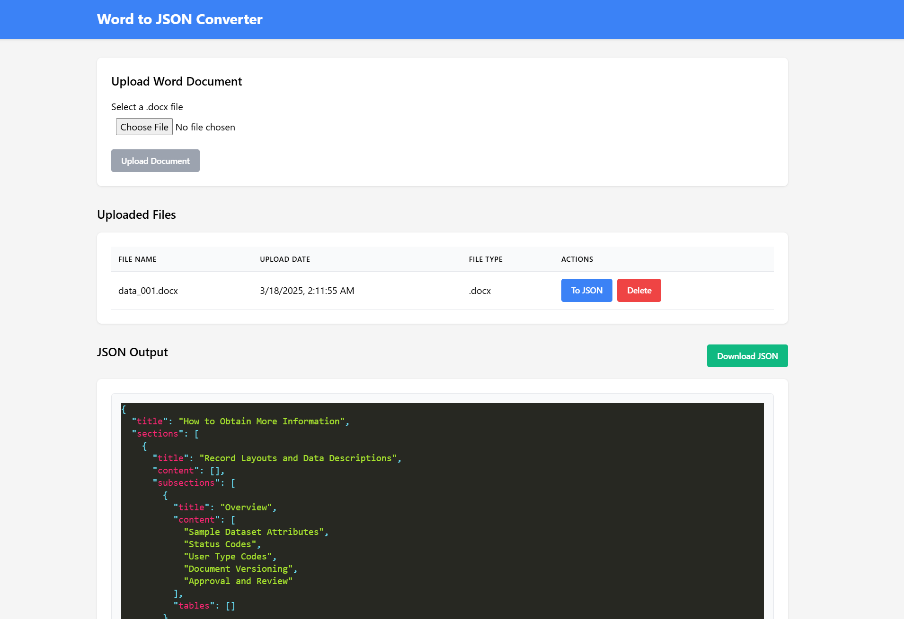

# Word to JSON Converter

Hello there! This repo holds a react-app and a fast-api backend that allows conversion of word .docx files to Json format and shows them on the webpage. This was done as part of a technical assessment for interview for a full stack position.


*The application interface showing file upload, management, and JSON conversion features*


## Technical Stack

### Backend
- **FastAPI**: A modern, fast API framework that makes building APIs a breeze
- **Python-docx**: Powerful library that handles all the Word document parsing
- **MongoDB**: Reliable database for keeping track of your uploaded files
- **Python 3.x**: The friendly programming language powering it all

### Frontend
- **React.js**: Creates a smooth, interactive user experience
- **Axios**: Handles communication with the backend seamlessly
- **React-JSON-Pretty**: Makes your JSON output beautiful and readable
- **CSS**: Custom styling to make everything look good

### DevOps & Deployment
- **Docker**: Packages everything up so it runs the same way everywhere
- **Docker Compose**: Orchestrates all the parts working together
- **Nginx**: Efficiently serves the frontend and routes API requests

## Project Structure

```
project/
├── backend/
│   ├── extract_data.py     # The magic that parses Word documents
│   ├── main.py             # The API that handles all requests
│   ├── requirements.txt    # What the backend needs to run
│   ├── Dockerfile          # How to containerize the backend
│   └── stored_files/       # Where your documents are stored
│
├── frontend/
│   ├── src/                # The React app's source code
│   ├── public/             # Public assets
│   ├── package.json        # Frontend dependencies
│   ├── Dockerfile          # How to containerize the frontend
│   └── nginx.conf          # Web server configuration
│
├── docker-compose.yml      # How everything works together
└── README.md               # You are here! 👀
```

## Getting Started

### What You'll Need
- Docker and Docker Compose installed on your computer
- Git for downloading the code

### Running the Application

1. Clone the repository:
   ```
   git clone https://github.com/s-mahabadi/full-stack-technical-assessment.git
   cd word-to-json-converter
   ```

2. Fire up the application:
   ```
   docker-compose up -d
   ```

3. Open your browser and go to:
   ```
   http://localhost:80
   ```

That's it! You're ready to start converting documents.

## API Details

If you're a developer and want to integrate with the system, here are the available endpoints:

- **POST /api/uploadFile**: Upload a Word document
- **GET /api/getFiles**: Get a list of all uploaded files
- **DELETE /api/deleteFile/{file_id}**: Delete a specific file
- **GET /api/WordToJson/{file_id}**: Convert a document to JSON

## Development Notes

Instructions on how to run in dev mode:

#### Backend
```
cd backend
pip install -r requirements.txt
uvicorn main:app --reload
```

#### Frontend
```
cd frontend
npm install
npm start
```

## Troubleshooting

Run into issues with Docker containers? Try this quick fix:
```
docker-compose down
docker rm -f $(docker ps -a -q)
docker-compose up -d
```

## License

This project is licensed under the MIT License - see the LICENSE file for details.
